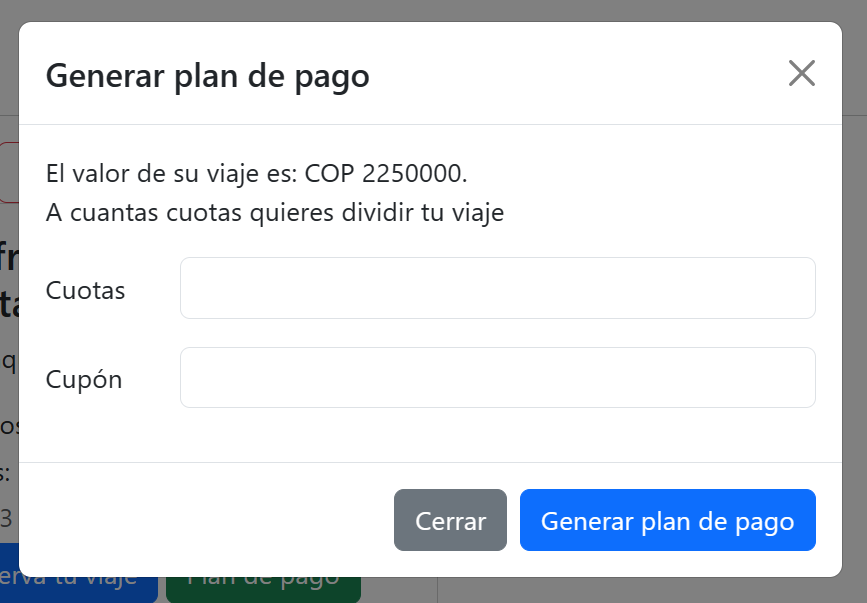

# MiViajeColombia.com

El siguiente proyecto busca que las personas que deseen viajar conoscan el costo de su viaje a los cuatro lugares que la pagina les ofrece, en este caso son:

* Cali.
* Medellín.
* Santa Marta.
* Cartagena.

Para acceder al costo del viaje, el simulador, por medio de un formulario al cual se accede con el boton _crea tu viaje_ especifica el __destino__, los __adultos__, __niños__ y __días__ para que la persona interesada en viajar conozca las tarifas que el paquete de viaje les ofrece.

    

De igual manera el programa da la opción de diferir el viaje a cuotas. Este se lo puede observar al acceder por medio del boton _Mostrar Resumen del viaje_, en esta parte encontrara el _Plan de pago_. Si la persona esta satisfecha con el precio y las _cuotas_ que a diferido su viaje podrá seguir a la opcion de _Reserva tu viaje_. 

    

Por otra parte tambien existe la opción de acceder a cupones los cuales al ser utilizado les da un porcentaje de descuento al aplicarlo.

En el caso de los cupones el programa da los siguientes codigos los cuales se encuentran en el archivo cupones.jason, los cuales al colocarlos en el input de _cupón_, aplicara el descuesto, de lo contrario el precio seguira siendo el mismo. 

    

    "89ICH09",
    "72EXW67",
    "43RYV87",
    "59ABK21",
    "85YIU87",
    "72WEM79",
    "65YUC54",
    "23CGT37",
    "97WPN67",
    "56CVN33"

